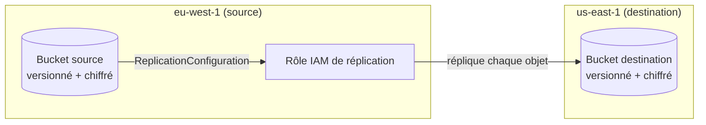

# S3 Cross-Region Replication

[](https://github.com/Julionores/s3-cross-region-replication/actions/workflows/ci.yml)

Réplication automatique d'objets S3 entre deux régions AWS (`eu-west-1` → `us-east-1`),
avec les deux templates CloudFormation nécessaires : le bucket de destination et le bucket
source **avec sa configuration de réplication réellement posée** — la pièce qui manquait
dans le template de cours dont ce projet est issu (celui-ci créait le bucket source et le
rôle IAM de réplication, mais ne les reliait jamais l'un à l'autre : aucune réplication ne
se produisait en pratique).

> Projet réalisé par **Junior Tsafack Megnekeu** ([blog.jtmcloud.com](https://blog.jtmcloud.com) ·
> [GitHub](https://github.com/Julionores) ·
> [LinkedIn](https://www.linkedin.com/in/junior-tsafack-megnekeu-b673151b9)) — pièce d'un
> portfolio technique orienté Cloud/DevOps. Voir aussi
> [`dynamodb-streams-cdc-pipeline`](https://github.com/Julionores/dynamodb-streams-cdc-pipeline),
> [`aws-troubleshooting-challenge`](https://github.com/Julionores/aws-troubleshooting-challenge),
> [`aws-alb-deployment-patterns`](https://github.com/Julionores/aws-alb-deployment-patterns) et
> [`aws-vpc-connectivity-patterns`](https://github.com/Julionores/aws-vpc-connectivity-patterns).
> Côté DevSecOps/Full Stack, voir aussi
> [`devsecops-pipeline-reference`](https://github.com/Julionores/devsecops-pipeline-reference),
> [`securebank-api`](https://github.com/Julionores/securebank-api),
> [`postgresql-ha-repmgr`](https://github.com/Julionores/postgresql-ha-repmgr) et
> [`iso27001-isms-toolkit`](https://github.com/Julionores/iso27001-isms-toolkit).
> Côté Machine Learning, voir aussi [`gradientforge`](https://github.com/Julionores/gradientforge),
> [`radar-risque-impaye`](https://github.com/Julionores/radar-risque-impaye),
> [`collecte-agricole-planner`](https://github.com/Julionores/collecte-agricole-planner),
> [`ticket-tide`](https://github.com/Julionores/ticket-tide) et
> [`inspectline`](https://github.com/Julionores/inspectline), un détecteur d'objets
> (Faster R-CNN) pour le contrôle qualité industriel.

## Architecture



## Ce qui a été corrigé par rapport au template de cours d'origine

| | Template de cours | Ce dépôt |
|---|---|---|
| Bucket source + versioning | ✅ | ✅ |
| Rôle IAM de réplication | ✅ | ✅ |
| **`ReplicationConfiguration` sur le bucket** | ❌ absente | ✅ ajoutée (`Filter`/`Priority`/`DeleteMarkerReplication`, syntaxe V2 actuelle) |
| Chiffrement par défaut des buckets | ❌ | ✅ SSE-S3 (AES256) |
| Blocage d'accès public | ❌ | ✅ activé sur les deux buckets |

Sans la `ReplicationConfiguration`, le rôle IAM et ses permissions existent mais ne sont
jamais invoqués : c'est une erreur facile à ne pas remarquer en relisant le template, car
tous les éléments *semblent* présents.

## Vérification réelle (testée sur deux régions AWS)

1. Déploiement du bucket destination dans `us-east-1`, puis du bucket source + réplication
   dans `eu-west-1`.
2. Upload d'un objet de test dans le bucket source :
   ```bash
   aws s3 cp test-object.txt s3://<bucket-source>/test-object.txt --region eu-west-1
   ```
3. Vérification côté destination, **~20 secondes plus tard** :
   ```bash
   aws s3api head-object --bucket <bucket-destination> --key test-object.txt --region us-east-1
   ```
   ```json
   { "ContentLength": 54, "ServerSideEncryption": "AES256", "ReplicationStatus": "REPLICA" }
   ```
4. Vérification côté source :
   ```bash
   aws s3api head-object --bucket <bucket-source> --key test-object.txt --region eu-west-1 \
     --query "ReplicationStatus"
   "COMPLETED"
   ```
5. Buckets vidés (obligatoire pour un bucket versionné) et stacks supprimées dans les deux
   régions après le test.

## Déploiement

```bash
# 1. Bucket destination, dans la région de destination
aws cloudformation deploy \
  --template-file cloudformation/template-destination.yaml \
  --stack-name s3-crr-destination \
  --parameter-overrides DestinationBucketName=<nom-unique-destination> \
  --region us-east-1

# 2. Bucket source + réplication, dans la région source
aws cloudformation deploy \
  --template-file cloudformation/template-source.yaml \
  --stack-name s3-crr-source \
  --parameter-overrides SourceBucketName=<nom-unique-source> DestinationBucketName=<nom-unique-destination> \
  --capabilities CAPABILITY_IAM \
  --region eu-west-1
```

## Validation

```bash
pip install cfn-lint
cfn-lint cloudformation/template-destination.yaml
cfn-lint cloudformation/template-source.yaml
```

## Limites assumées

- La réplication ne couvre que les objets écrits **après** l'activation de la configuration
  (comportement standard de la réplication S3 -- les objets déjà présents avant activation
  ne sont pas rétroactivement répliqués sans une tâche de type S3 Batch Replication).
- `DeleteMarkerReplication` est désactivé : la suppression d'un objet côté source n'est pas
  répliquée côté destination (choix explicite, à adapter selon le besoin métier réel — une
  réplication à but d'archivage voudra généralement l'inverse).
- Aucune règle de cycle de vie (transition vers Glacier, expiration) n'est configurée sur le
  bucket destination : à ajouter selon la finalité (sauvegarde, conformité, latence de
  lecture régionale...).

## Licence

MIT — voir [`LICENSE`](LICENSE). Projet à but pédagogique et de démonstration.
